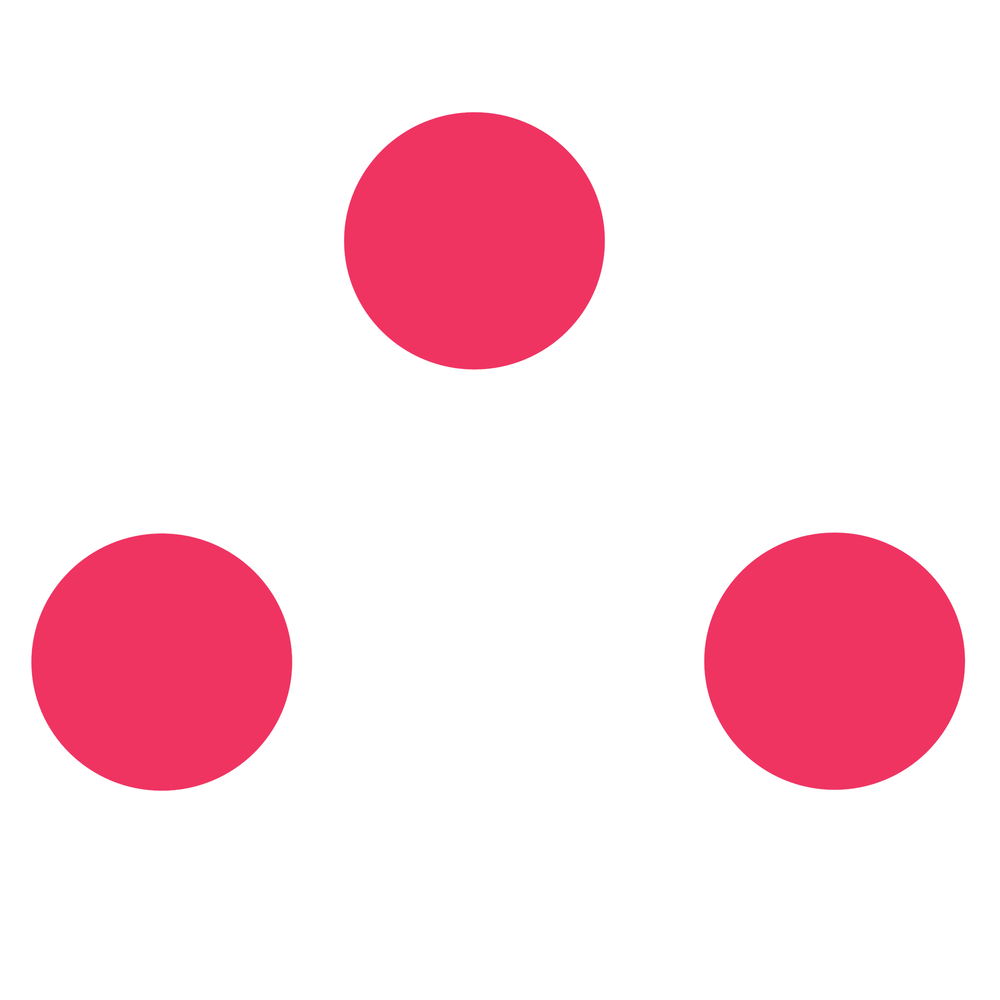

---
# Feel free to add content and custom Front Matter to this file.
# To modify the layout, see https://jekyllrb.com/docs/themes/#overriding-theme-defaults

layout: default
---

 <!-- <h2>Little Theorems</h2> -->
 <h2>NLT</h2>

 

 <a href="{{ site.baseurl }}">
   

      <h3 class="card-link">5 Life Lessons from Programming to Take into 2019</h3>
      Jan 13, 2019
        
      
With new year resolutions in mind, I am going to apply 5 programming principles to my life in order to live a better 2019.
 
   

 </a>
 <a href="{{ site.baseurl }}">
   

      <h3 class="card-link">New Post</h3>
      Nov 15, 2018
        
      
The "science" and "math" of STEM are already well integrated in K-12 schools. What about technology?
 
   

 </a>
 <a href="{{ site.baseurl }}">
    

       <h3 class="card-link">Imposter Syndrome</h3>
       Nov 8, 2018
         
       
Ever feel like you just got lucky, and your successes are not due to your own abilities? Same.
 
    

  </a>
 

 

  <a href="about">
   

     
   

   </a>
   

   <h2 style="color:#5b5b5b">Quote of the Week</h2>
     
"Humans are allergic to change. They love to say, 'We've always done it this way.' I try to fight that. That's why I have a clock on my wall that runs counter-clockwise." - Grace Hopper

   

   <a href="archive.html">
   

     

     
     

   

   </a>
 

